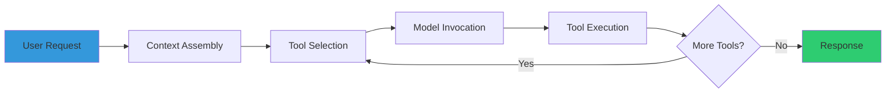

# claude-code-ultimate-guide

> Skill by [ara.so](https://ara.so) — Claude Code Skills collection.

Expert guidance for the Claude Code Ultimate Guide — a 24K+ line comprehensive resource covering Claude Code from beginner to power user, including architecture deep-dives, agentic workflows, security hardening (28 CVEs tracked), methodology guides (TDD/SDD/BDD), 271-question quiz, and 181 production-ready templates.

## What This Guide Provides

**Educational depth + practical templates:**
- **Mental models**: How Claude Code works internally (architecture, context flow, tool orchestration)
- **Decision frameworks**: When to use agents vs skills vs commands (trade-off analysis)
- **Security-first**: Only guide with threat database (28 CVEs + 655 malicious skills)
- **Methodology workflows**: TDD/SDD/BDD comparison + step-by-step implementation
- **48 Mermaid diagrams**: Visual architecture, patterns, security flows
- **271-question quiz**: Validate understanding across 7 modules
- **181 templates**: Production-ready examples in TypeScript, Python, Rust, Go, etc.

## Installation & Access

### Option 1: MCP Server (Recommended — No Cloning)

Add to `~/.claude.json`:

```json
{
  "mcpServers": {
    "claude-code-guide": {
      "type": "stdio",
      "command": "npx",
      "args": ["-y", "claude-code-ultimate-guide-mcp"]
    }
  }
}
```

**Usage:**
```bash
# Search the guide
claude "Use claude-code-guide to search for 'security threats'"

# Get specific section
claude "Use claude-code-guide to read the TDD methodology section"

# Get cheatsheet
claude "Use claude-code-guide to show me the cheatsheet"

# List examples by topic
claude "Use claude-code-guide to list all rust examples"
```

### Option 2: Clone Repository

```bash
git clone https://github.com/FlorianBruniaux/claude-code-ultimate-guide.git
cd claude-code-ultimate-guide

# Browse structure
ls -la guide/        # 24K+ lines of documentation
ls -la examples/     # 181 production templates
ls -la quiz/         # 271 questions across 7 modules
```

### Option 3: Interactive Onboarding (No Setup)

```bash
claude "Fetch and follow the onboarding instructions from: https://raw.githubusercontent.com/FlorianBruniaux/claude-code-ultimate-guide/main/tools/onboarding-prompt.md"
```

## Key MCP Server Tools

When using the MCP server, you have access to 17 tools:

```typescript
// Search across all guide content
search_guide({ query: "agentic workflows", maxResults: 5 })

// Read specific sections
read_section({ 
  section: "guide/methodologies/tdd-with-ai.md" 
})

// Get quick reference
get_cheatsheet()

// Find templates
search_examples({ 
  query: "typescript react", 
  language: "typescript" 
})

// Get specific example
get_example({ path: "examples/typescript/react-tdd.md" })

// Security threat lookup
get_threat({ cveId: "CVE-2024-1234" })
list_threats({ category: "prompt-injection" })

// Compare versions
compare_versions({ 
  from: "3.39.0", 
  to: "3.40.0" 
})
```

**13 slash commands also available:**
```bash
/ccguide:search security
/ccguide:read guide/security/security-hardening.md
/ccguide:cheatsheet
/ccguide:examples typescript
/ccguide:quiz beginner
```

## Repository Structure

```
claude-code-ultimate-guide/
├── guide/                    # 24K+ lines documentation
│   ├── ultimate-guide.md     # Main comprehensive guide
│   ├── cheatsheet.md         # 1-page daily essentials
│   ├── architecture/         # Internal workings
│   ├── methodologies/        # TDD/SDD/BDD workflows
│   ├── security/             # Threat modeling, CVEs
│   ├── diagrams/             # 48 Mermaid visualizations
│   └── learning-path/        # 7-module progression
├── examples/                 # 181 production templates
│   ├── typescript/
│   ├── python/
│   ├── rust/
│   ├── go/
│   └── workflows/
├── quiz/                     # 271 questions
│   ├── beginner/
│   ├── intermediate/
│   └── advanced/
├── tools/                    # Utilities
│   ├── onboarding-prompt.md
│   └── self-assessment.md
└── mcp-server/              # MCP implementation
```

## Core Concepts & Workflows

### 1. Architecture Mental Models

**Claude Code's Master Loop:**


**Key insight**: Claude Code orchestrates tools in a loop. Understanding this helps you design effective prompts and know when to split complex tasks.

### 2. Agent vs Skill vs Command Decision Framework

```typescript
// AGENT — Long-running, multi-step, adaptive
// Example: Refactor entire codebase following TDD
{
  role: "tdd-refactor-agent",
  goal: "Refactor auth module with 100% test coverage",
  constraints: ["Red-Green-Refactor cycle", "No breaking changes"]
}

// SKILL — Domain expertise, reusable across sessions
// Example: "Apply TDD workflow to new feature"
{
  name: "tdd-workflow",
  triggers: ["write tests first", "tdd this feature"],
  knowledge: "guide/methodologies/tdd-with-ai.md"
}

// COMMAND — Single execution, explicit tool call
// Example: "Run tests and show coverage"
/test --coverage
```

**Decision tree:**
- **Multi-step adaptive?** → Agent
- **Reusable expertise?** → Skill  
- **One-shot execution?** → Command

### 3. TDD Workflow with Claude Code

```bash
# 1. Start with failing test (RED)
claude "Write a failing test for user registration validation"

# 2. Minimal implementation (GREEN)
claude "Implement just enough code to make the test pass"

# 3. Refactor (REFACTOR)
claude "Refactor the validation logic while keeping tests green"

# 4. Repeat
claude "Next test: email uniqueness constraint"
```

**Full workflow:** See `guide/methodologies/tdd-with-ai.md`

### 4. Security Threat Awareness

**28 CVEs tracked in database:**
```bash
# Check for prompt injection vulnerabilities
claude "Use claude-code-guide to get threat info for CVE-2024-5184"

# List all model-confusion attacks
claude "Use claude-code-guide to list threats in category 'model-confusion'"
```

**Common threats:**
- **Prompt Injection**: User input manipulating agent behavior
- **Tool Misuse**: Agents accessing unauthorized resources
- **Context Leakage**: Sensitive data in prompts/logs
- **Supply Chain**: Malicious skills (655 tracked)

**See:** `guide/security/security-hardening.md`

## Real-World Examples

### Example 1: TDD React Component (TypeScript)

```typescript
// examples/typescript/react-tdd-component.md

// Step 1: Write test first
import { render, screen, fireEvent } from '@testing-library/react';
import { LoginForm } from './LoginForm';

describe('LoginForm', () => {
  it('validates email format before submission', () => {
    render(<LoginForm onSubmit={jest.fn()} />);
    
    const input = screen.getByLabelText('Email');
    const submit = screen.getByRole('button', { name: 'Login' });
    
    fireEvent.change(input, { target: { value: 'invalid-email' } });
    fireEvent.click(submit);
    
    expect(screen.getByText('Invalid email format')).toBeInTheDocument();
  });
});

// Step 2: Minimal implementation
export const LoginForm: React.FC<Props> = ({ onSubmit }) => {
  const [email, setEmail] = useState('');
  const [error, setError] = useState('');
  
  const handleSubmit = (e: React.FormEvent) => {
    e.preventDefault();
    if (!/\S+@\S+\.\S+/.test(email)) {
      setError('Invalid email format');
      return;
    }
    onSubmit({ email });
  };
  
  return (
    <form onSubmit={handleSubmit}>
      <label htmlFor="email">Email</label>
      <input 
        id="email" 
        value={email} 
        onChange={(e) => setEmail(e.target.value)} 
      />
      {error && <span>{error}</span>}
      <button type="submit">Login</button>
    </form>
  );
};
```

**Prompt to Claude Code:**
```bash
claude "Follow TDD workflow from the guide:
1. I'll describe a feature
2. You write the test first (RED)
3. Then minimal implementation (GREEN)
4. Then refactor suggestions (REFACTOR)

Feature: Login form with email validation and password strength meter"
```

### Example 2: Secure Agentic Workflow (Python)

```python
# examples/python/secure-agent-workflow.py

from typing import List, Dict
import os

class SecureAgentWorkflow:
    """
    Demonstrates security best practices from guide/security/
    - Input sanitization
    - Tool allowlisting
    - Audit logging
    """
    
    def __init__(self, allowed_tools: List[str]):
        self.allowed_tools = set(allowed_tools)
        self.audit_log = []
    
    def execute_task(self, user_input: str, context: Dict) -> str:
        # 1. Sanitize input (prevent prompt injection)
        sanitized = self._sanitize_input(user_input)
        
        # 2. Log for audit trail
        self._log_action("task_start", {
            "input": sanitized,
            "context_keys": list(context.keys())
        })
        
        # 3. Tool allowlist enforcement
        requested_tools = self._extract_tools(sanitized)
        if not requested_tools.issubset(self.allowed_tools):
            forbidden = requested_tools - self.allowed_tools
            raise PermissionError(f"Tools not allowed: {forbidden}")
        
        # 4. Execute with minimal permissions
        result = self._execute_with_restrictions(sanitized, context)
        
        # 5. Audit successful execution
        self._log_action("task_complete", {"result_length": len(result)})
        
        return result
    
    def _sanitize_input(self, text: str) -> str:
        """Remove potential prompt injection patterns"""
        dangerous_patterns = [
            "ignore previous instructions",
            "you are now",
            "system:",
            "assistant:"
        ]
        sanitized = text
        for pattern in dangerous_patterns:
            sanitized = sanitized.replace(pattern, "[REDACTED]")
        return sanitized
    
    def _log_action(self, action: str, metadata: Dict):
        """Audit trail for security review"""
        self.audit_log.append({
            "action": action,
            "metadata": metadata,
            "timestamp": datetime.now().isoformat()
        })
        # In production: send to SIEM
        print(f"[AUDIT] {action}: {metadata}")

# Usage with Claude Code
workflow = SecureAgentWorkflow(
    allowed_tools=["read_file", "write_file", "execute_command"]
)

# This will succeed
workflow.execute_task(
    "Read config.json and format as YAML",
    context={"cwd": "/safe/path"}
)

# This will raise PermissionError
workflow.execute_task(
    "Delete all files",  # Requires forbidden tool
    context={}
)
```

**Prompt to Claude Code:**
```bash
claude "Using the secure agent workflow pattern from the guide:
1. Review my agent code for security vulnerabilities
2. Apply input sanitization from guide/security/security-hardening.md
3. Add tool allowlisting
4. Implement audit logging
5. Show before/after diff"
```

### Example 3: Multi-Agent SDD Pattern (Rust)

```rust
// examples/rust/multi-agent-sdd.rs

// Spec-Driven Development with multiple specialized agents
// Pattern from guide/methodologies/sdd-with-ai.md

/// Agent 1: Spec Writer
/// Generates formal specifications from requirements
pub struct SpecAgent;

impl SpecAgent {
    pub fn generate_spec(requirements: &str) -> ApiSpec {
        // Claude Code prompt:
        // "Write OpenAPI 3.0 spec for: {requirements}"
        ApiSpec {
            version: "3.0.0".into(),
            endpoints: vec![
                Endpoint {
                    path: "/users".into(),
                    method: Method::POST,
                    request: Schema::object(vec![
                        ("email", Schema::string_format("email")),
                        ("password", Schema::string_min_length(8))
                    ]),
                    response: Schema::object(vec![
                        ("id", Schema::uuid()),
                        ("created_at", Schema::datetime())
                    ])
                }
            ]
        }
    }
}

/// Agent 2: Test Generator
/// Creates contract tests from spec
pub struct TestAgent;

impl TestAgent {
    pub fn generate_tests(spec: &ApiSpec) -> Vec<Test> {
        // Claude Code prompt:
        // "Generate contract tests for spec: {spec.to_json()}"
        spec.endpoints.iter().map(|endpoint| {
            Test {
                name: format!("test_{}_contract", endpoint.path),
                assertions: vec![
                    Assertion::status_code(201),
                    Assertion::schema_matches(&endpoint.response),
                    Assertion::response_time_under(100)
                ]
            }
        }).collect()
    }
}

/// Agent 3: Implementation Agent
/// Writes code to satisfy spec + tests
pub struct ImplAgent;

impl ImplAgent {
    pub fn implement(spec: &ApiSpec, tests: &[Test]) -> String {
        // Claude Code prompt:
        // "Implement handlers that pass these tests: {tests}"
        // "Must satisfy spec: {spec}"
        r#"
        #[post("/users")]
        async fn create_user(body: Json<CreateUserRequest>) -> Result<Json<User>, Error> {
            // Validate against spec schema
            body.validate()?;
            
            let user = User::create(body.email, body.password).await?;
            Ok(Json(user))
        }
        "#.into()
    }
}

// Orchestration
#[tokio::main]
async fn main() {
    let requirements = "User registration API with email validation";
    
    // Agent 1: Spec
    let spec = SpecAgent::generate_spec(requirements);
    println!("Spec: {}", serde_json::to_string_pretty(&spec).unwrap());
    
    // Agent 2: Tests
    let tests = TestAgent::generate_tests(&spec);
    println!("Generated {} contract tests", tests.len());
    
    // Agent 3: Implementation
    let code = ImplAgent::implement(&spec, &tests);
    println!("Implementation:\n{}", code);
    
    // Verify: tests pass against implementation
    run_tests(&tests, &code).await.expect("Tests must pass");
}
```

**Prompt to Claude Code:**
```bash
claude "Set up SDD multi-agent workflow:
1. I provide requirements
2. Spec agent writes OpenAPI spec
3. Test agent generates contract tests
4. Implementation agent writes code
5. Verification agent runs tests

Start with: User authentication API with JWT tokens"
```

## Configuration & Customization

### MCP Server Configuration

```json
// ~/.claude.json
{
  "mcpServers": {
    "claude-code-guide": {
      "type": "stdio",
      "command": "npx",
      "args": ["-y", "claude-code-ultimate-guide-mcp"],
      "env": {
        // Optional: customize behavior
        "GUIDE_DEFAULT_RESULTS": "10",
        "GUIDE_INCLUDE_DIAGRAMS": "true"
      }
    }
  }
}
```

### Custom Learning Path

```bash
# Self-assessment to get personalized path
claude "Use claude-code-guide to run /ccguide:assessment"

# Answer questions about:
# - Experience level (beginner/intermediate/advanced)
# - Primary language (TypeScript/Python/Rust/Go)
# - Focus area (security/methodologies/architecture/workflows)

# Receive custom path like:
# 1. Start: guide/learning-path/module-1-foundations.md
# 2. Then: guide/methodologies/tdd-with-ai.md
# 3. Practice: examples/typescript/tdd-examples/
# 4. Quiz: quiz/intermediate/methodologies.md
```

### Skill Integration

```yaml
# skills/claude-code-expert.md
---
name: claude-code-expert
description: Expert in Claude Code workflows using ultimate guide knowledge
triggers:
  - apply best practices from the guide
  - use claude code ultimate guide methodology
---

When the user requests Claude Code guidance:
1. Use the `claude-code-guide` MCP server to search relevant sections
2. Apply patterns from examples/ directory
3. Reference security guidelines for sensitive operations
4. Suggest quiz questions to validate understanding

Knowledge sources:
- guide/ultimate-guide.md (comprehensive reference)
- guide/cheatsheet.md (quick patterns)
- guide/methodologies/ (TDD/SDD/BDD workflows)
- guide/security/ (threat modeling)
```

## Common Patterns & Use Cases

### Pattern 1: Progressive Learning Path

```bash
# Week 1: Foundations
claude "Use claude-code-guide to read learning-path/module-1-foundations.md"
claude "Use claude-code-guide to quiz me on beginner concepts"

# Week 2: Methodologies  
claude "Use claude-code-guide to read methodologies/tdd-with-ai.md"
claude "Show me examples/typescript/tdd-examples/"
claude "Use claude-code-guide to quiz me on TDD patterns"

# Week 3: Architecture
claude "Use claude-code-guide to read architecture/master-loop.md"
claude "Explain the decision tree for agents vs skills vs commands"

# Week 4: Security
claude "Use claude-code-guide to read security/security-hardening.md"
claude "List all CVEs related to prompt injection"
```

### Pattern 2: On-Demand Expertise

```bash
# During development, pull specific guidance
claude "I'm implementing a new API. Use claude-code-guide to show me the SDD workflow"

# When stuck, search for solutions
claude "Use claude-code-guide to search for 'debugging multi-agent workflows'"

# Before committing, security check
claude "Use claude-code-guide to list security threats for my agentic workflow"
```

### Pattern 3: Template-Driven Development

```bash
# Find template for your stack
claude "Use claude-code-guide to search examples for 'python fastapi tdd'"

# Get full template
claude "Use claude-code-guide to get example examples/python/fastapi-tdd-template.md"

# Customize for your project
claude "Adapt this template for a GraphQL API with subscription support"
```

## Troubleshooting

### MCP Server Not Found

**Symptom:**
```
Error: MCP server 'claude-code-guide' not found
```

**Solution:**
```bash
# Verify npx can access package
npx -y claude-code-ultimate-guide-mcp --version

# Check ~/.claude.json syntax
cat ~/.claude.json | jq .

# Restart Claude Code
# macOS: cmd+shift+p → "Reload Window"
# Linux/Win: ctrl+shift+p → "Reload Window"
```

### Search Returns No Results

**Symptom:**
```typescript
search_guide({ query: "authentication" }) // Returns []
```

**Solution:**
```bash
# Try broader terms
search_guide({ query: "auth" })

# Use topic-based search
list_topics() // See all available topics
search_guide({ query: "security" })

# Check specific sections
read_section({ section: "guide/security/authentication.md" })
```

### Quiz Questions Too Hard/Easy

**Solution:**
```bash
# Take self-assessment first
/ccguide:assessment

# Start with recommended module
# Beginner → quiz/beginner/
# Intermediate → quiz/intermediate/  
# Advanced → quiz/advanced/

# Review concepts before quiz
claude "Use claude-code-guide to read the foundations module before quizzing me"
```

### Examples Don't Match My Stack

**Solution:**
```bash
# Search by language
search_examples({ language: "rust" })

# Search by framework
search_examples({ query: "fastapi" })

# Ask for adaptation
claude "Use this TypeScript example but convert it to Python with FastAPI:
[paste example]"
```

## Integration with Other Tools

### With Cursor

```bash
# Add MCP server to Cursor config
# ~/.cursor/config.json (same format as ~/.claude.json)

# Use in Cursor prompts
"@claude-code-guide search for testing patterns"
```

### With GitHub Copilot

```bash
# Reference guide in comments
# copilot will use context from open files

# Open relevant guide section in editor
code guide/methodologies/tdd-with-ai.md

# Then prompt copilot:
# "Follow the TDD workflow from the open guide file"
```

### With Custom Agents

```python
# agents/my_agent.py

from mcp import Client

class GuideAwareAgent:
    def __init__(self):
        self.guide = Client("claude-code-guide")
    
    async def get_best_practice(self, topic: str) -> str:
        results = await self.guide.call(
            "search_guide",
            {"query": topic, "maxResults": 3}
        )
        return results[0]["content"]
    
    async def execute_with_guidance(self, task: str):
        # Look up best practice first
        guidance = await self.get_best_practice(task)
        
        # Apply guidance to task
        return self.apply_pattern(task, guidance)
```

## Advanced Usage

### Custom Quiz Generation

```bash
# Generate quiz from any guide section
claude "Use claude-code-guide to read security/security-hardening.md
Then create 10 multiple-choice questions testing understanding of:
- Threat models
- CVE mitigation strategies  
- Tool allowlisting
Format like quiz/advanced/security.md"
```

### Diff-Based Learning

```bash
# Compare guide versions to learn what changed
claude "Use claude-code-guide to compare versions 3.39.0 and 3.40.0
Explain what new patterns were added and why"

# Track official Anthropic docs changes
claude "Use claude-code-guide to diff official docs since last week
Highlight breaking changes"
```

### Building Custom Skills from Guide

```bash
# Extract pattern into reusable skill
claude "Use claude-code-guide to read methodologies/tdd-with-ai.md
Create a skill file skills/tdd-enforcer.md that:
1. Triggers on 'write tests first'
2. Refuses to write implementation before tests
3. Uses Red-Green-Refactor cycle
4. References guide sections for explanation"
```

## Resources & Further Reading

**Within this guide:**
- Full guide: `guide/ultimate-guide.md` (24K+ lines)
- Quick reference: `guide/cheatsheet.md` (1 page)
- Learning path: `guide/learning-path/` (7 modules, 8-11 hours)
- Visual diagrams: `guide/diagrams/` (48 Mermaid diagrams)
- Threat database: `guide/security/threat-database.md` (28 CVEs)

**External resources:**
- Website: https://cc.bruniaux.com/
- MCP Package: https://www.npmjs.com/package/claude-code-ultimate-guide-mcp
- Release notes: https://github.com/FlorianBruniaux/claude-code-ultimate-guide/releases
- Awesome list: https://github.com/hesreallyhim/awesome-claude-code

**Complementary guides:**
- everything-claude-code: https://github.com/beanlab/everything-claude-code (battle-tested configs)
- claude-cowork-guide: https://github.com/FlorianBruniaux/claude-cowork-guide (non-dev use cases)

## Summary Cheatsheet

```bash
# === MCP Server Usage ===
# Search guide
claude "Use claude-code-guide to search for {topic}"

# Read section
claude "Use claude-code-guide to read {path}"

# Get cheatsheet
claude "Use claude-code-guide to show cheatsheet"

# Find examples
claude "Use claude-code-guide to search examples for {query}"

# === Learning Path ===
# Self-assessment
claude "Use claude-code-guide to run /ccguide:assessment"

# Quiz me
claude "Use claude-code-guide to quiz me on {topic}"

# === Security ===
# Check CVE
claude "Use claude-code-guide to get threat {CVE-ID}"

# List threats
claude "Use claude-code-guide to list threats in category {category}"

# === Version Tracking ===
# Compare versions
claude "Use claude-code-guide to compare versions {from} {to}"

# Get changelog
claude "Use claude-code-guide to get changelog"
```

**Daily workflow:**
1. Morning: Review cheatsheet for pattern reminders
2. During dev: Search guide for specific patterns
3. Before commit: Security threat check
4. End of week: Take quiz to validate learning

**Repository:** https://github.com/FlorianBruniaux/claude-code-ultimate-guide  
**License:** CC BY-SA 4.0  
**Maintained by:** Florian Bruniaux
